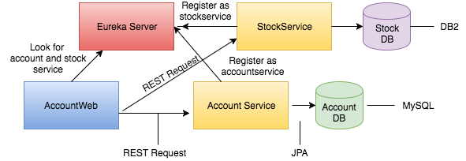
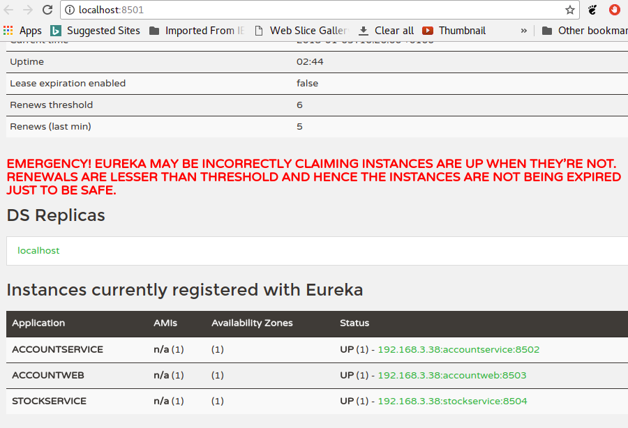
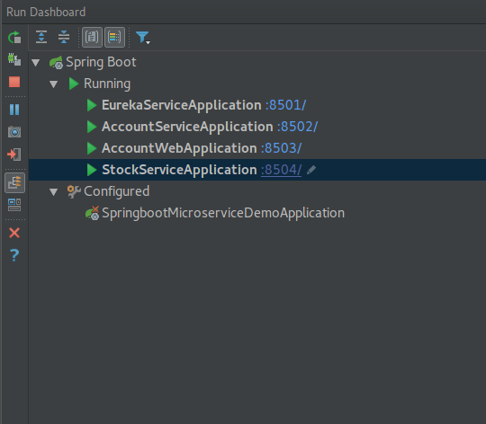
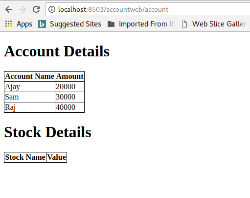
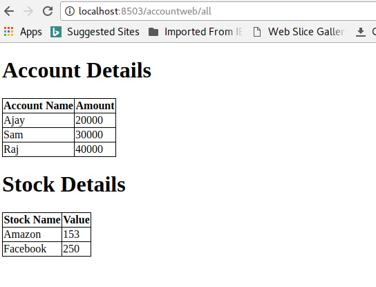

# springboot-microservice-demo
This project demonstrates how to implement microservice from springboot. Created stockservice and accountservice and configured in spring cloud and access the service from accountweb project.

# Overview of this project

# Account Service

* This project deals with account details. Used mysql database as backend.

* Created account db for accountservice.

* Implemented Rest Service 

* Used JPA for DB interaction

* Register this service in Eureka. (Spring cloud)

# Stock Service

* This project deals with stock details. Used mysql database as backend. 

* Created stock db for stockservice.

* Implemented Rest Service 

* Used JPA for DB interaction

* Register this service in Eureka. (Spring cloud)

# Account Web

* This project used as client system to access account and stock service.

* Register the project in Eureka.

* Accessing the account and stock service from Eureka server.

* Used Thymeleaf for showing account and stock details in the front end

### Keypoints ####

* AccountWeb project can able to get account and stock details through accessing the service which has register in the eureka.

* AccountWeb project still work if stockservice is down. User cant see the stock details. But User can able to see the account details.

* AccountWeb project still work if accountservice is down. User cant see the account details. But User can able to see stock details.

* If any changes in the account or stock service, User can able to deploy separately. No need to deploy accountweb project.

Note: In normal way, if any change in the service, it will impact the accountweb as well.

### Screenshots ###

### Happy Coding ###
